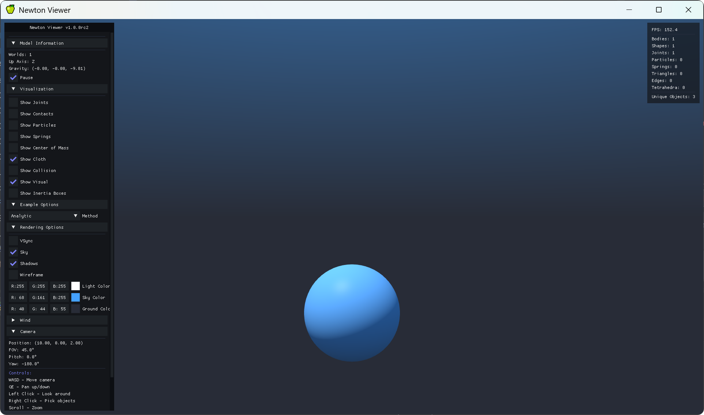

# Computer Animation - Exercise

## Overview

This repository contains the code for the computer animation exercise. The code uses [Newton@2a6df66](https://github.com/newton-physics/newton/tree/2a6df66595c05d655876a972df06ef810816a7bc) as a backend for the physics simulation.

## Agent scene framework

The repository also contains a prompt-driven framework for generating animations:

- `ca_framework.scene` defines a backend-neutral, JSON-serializable scene model for rigid bodies, cloth, fluids, constraints, and external fields.
- `ca_framework.mcp` provides protocol-independent scene editing tools.
- `mcp_server` exposes those tools through the official Python MCP SDK as a standalone stdio or Streamable HTTP server.
- `knowledge/skills` contains focused simulation knowledge that an agent can load when translating a prompt into a scene.

The runtime and agent-facing files intentionally contain no reference scenes or
reference answers. Black-box task prompts and benchmark commands live under
`evaluation/`; do not expose that directory to an agent during a prompt-to-video
experiment.

Start the stdio MCP server from the repository root:

```bash
uv run --project mcp_server ca-scene-mcp
```

Scene files are stored in `.ca-scenes` by default. Set `CA_SCENE_WORKSPACE` to use another directory. `SceneExecutorLocal` compiles rigid bodies and cloth to Newton XPBD/VBD, advances smoke and APIC/FLIP fluid routes, caches every simulated frame, and renders an output bundle. Final jobs use `run_scene(scene_name, output_dir)` and write `animation.mp4`, `scene.json`, `program.py`, `metrics.json`, `diagnostics.jsonl`, and `cache/`.

Development tests remain under `tests/`. Evaluation assets and instructions are
documented separately in `evaluation/README.md`.

### Numerical optimization

Scene optimization is a separate, reproducible workflow: an
`OptimizationPlan` defines bounded physical parameters, an optional `TaskSpec`
defines task losses, and Optuna proposes Random, TPE, or CMA-ES
trials. Every trial passes through static validation, a short coarse rejection
run, a full-resolution metric run, and optional finalist rendering. Optimization
history is never stored in `Scene.metadata`.

The MCP server exposes the complete lifecycle through
`create_optimization_plan`, `validate_optimization_plan`,
`start_optimization`, `get_optimization_job`, `list_optimization_trials`,
`get_optimization_trial`, `compare_optimization_trials`, and
`apply_optimization_trial`. A stored plan has three independent inputs:

```text
.ca-scenes/.optimizations/plans/<name>/
├── scene.json
├── optimization_plan.json
└── task_spec.json          # optional
```

Trial directories contain the applied scene and parameters, constraint-first
metrics, diagnostics, structured telemetry, and the final report. The report
selects the best feasible, fastest acceptable, and most robust candidates and
writes `best_so_far.svg` without requiring a plotting dependency.

## Installation

1. Install **Git** and [**uv**](https://docs.astral.sh/uv/getting-started/installation/) on your system.
   On Windows, **uv** can be simply installed by running the following command in PowerShell:
   ```powershell
   powershell -ExecutionPolicy ByPass -c "irm https://astral.sh/uv/install.ps1 | iex"
   ```
2. Clone this repository:
   ```bash
   git clone http://dalab.se.sjtu.edu.cn/gitlab/courses/ca-framework-2026.git
   ```
3. Install dependencies:
   ```bash
   uv sync --extra examples
   ```
4. Use any IDE (PyCharm is recommended) of your choice to open the project and run the script in `examples/ca_exercises/` directory. PyCharm will automatically recognize the virtual environments, if not, you can activate in the terminal using the command below:
   ```bash
   ./.venv/Scripts/activate
   ```
   
5. Then run the python script in the terminal:

   ```bash
   python ./newton/examples/ca_exercises/exercise2_xxx_xxx.py
   ```

   If everything's alright, you will see a window like below:
   
   Controls:
   - WASD: move camera
   - QE: move camera up/down
   - Left click: lock around

## Handin

**You only need to modify the `TODO` sections in the code.** You can run the code to test your implementation, but please do not modify the code structure or add any new files.

After you finish one exercise, **You only need to submit the modified `.py` files in `newton/_src/solvers/ca_exercises/`.** Please compress these files into a zip file and submit it to Canvas. The file name should be in the format of `ca_exercise<n>_<student_id>.zip`.

**Notes**: each exercise may have its own additional requirements, please pay attention.
